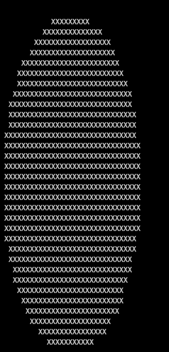
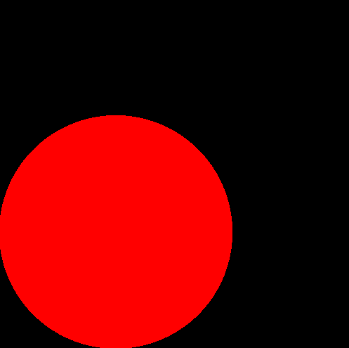
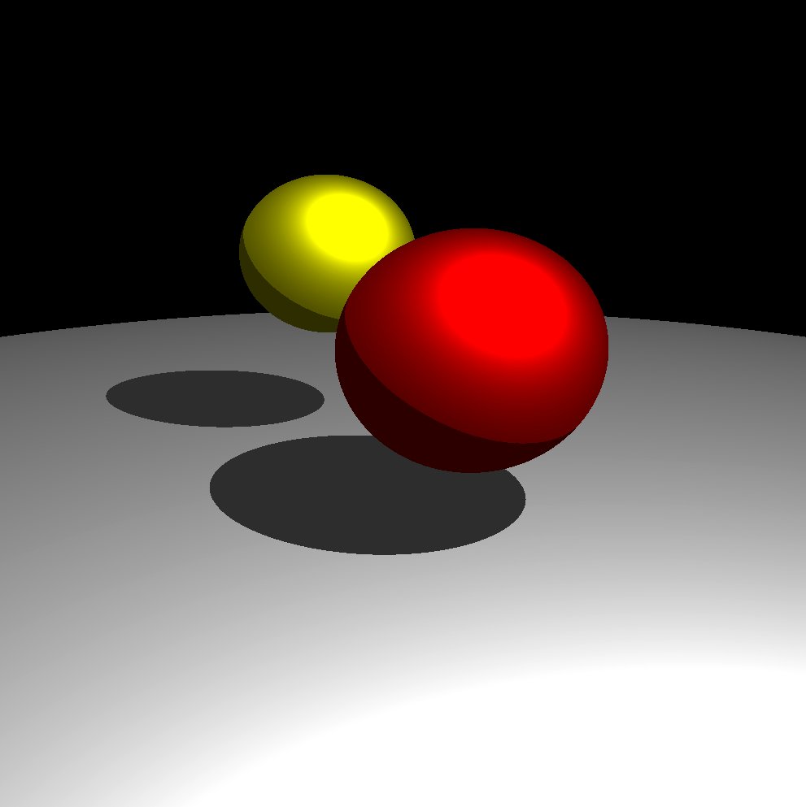
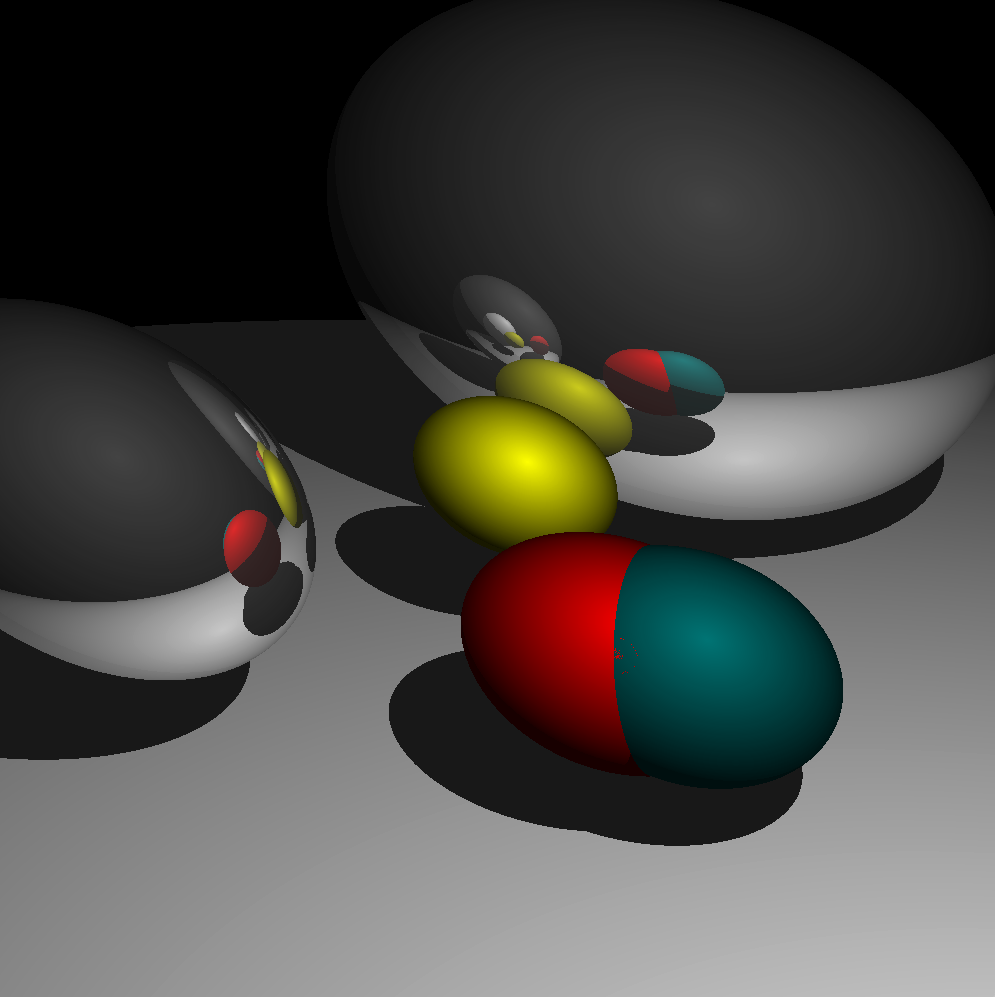

# Ray Tracer

This is my raytracer written in rust

# How To Run

Unoptimized
```
cargo run
```

Optimized version:
```
cargo build --release && time ./target/release/raytracer
```

Output is a bmp file

# Example Render (5000 rays per pixel)


# Old versions (single ray per pixel)

First render was at command line



First color render had just the shape



Added some shadows



The perspective was wrong at the beginning



First well working version


Added soft shadows


And opaque spheres


