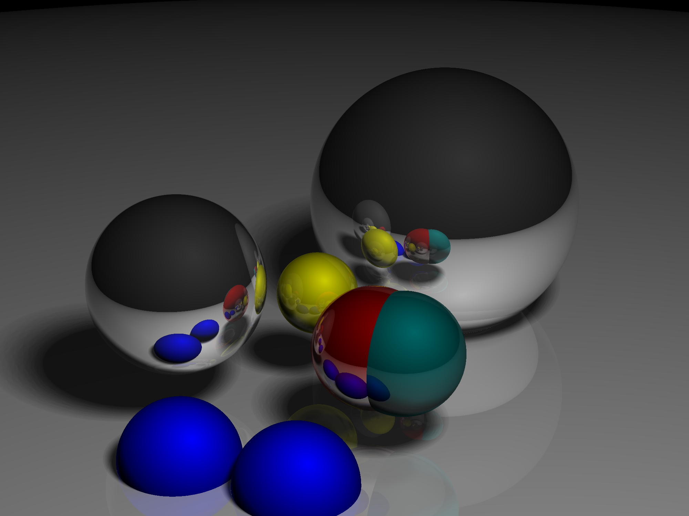
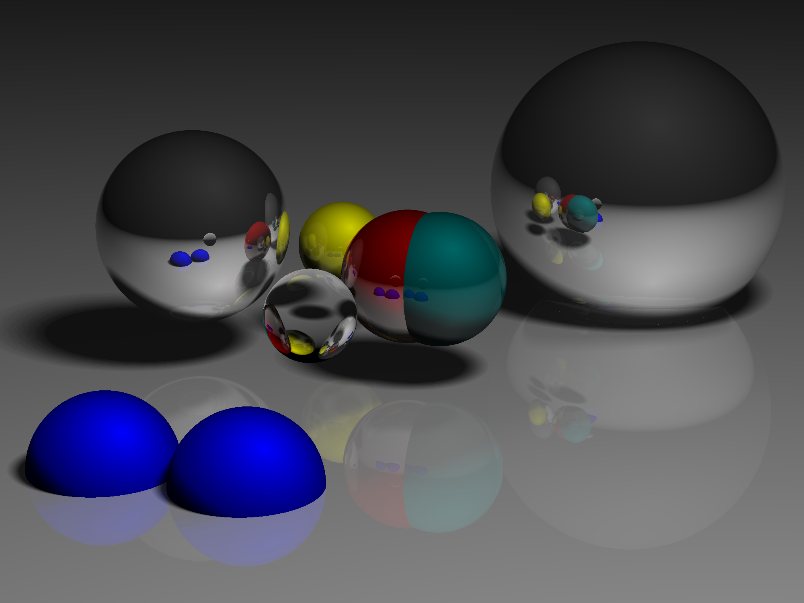

# Ray Tracer

This is my raytracer written in rust

# How To Run

Unoptimized
```
cargo run
```

Optimized version:
```
cargo build --release && time ./target/release/raytracer
```

Output is a bmp file

# Example Render


Now with soft shadows!



Now with opaque spheres!


